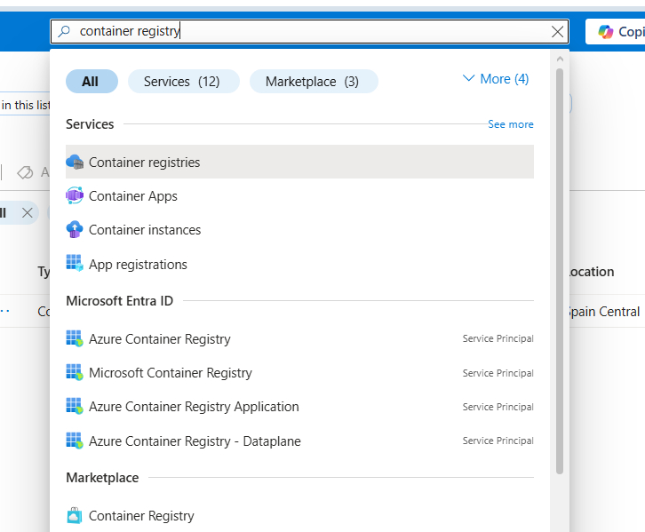
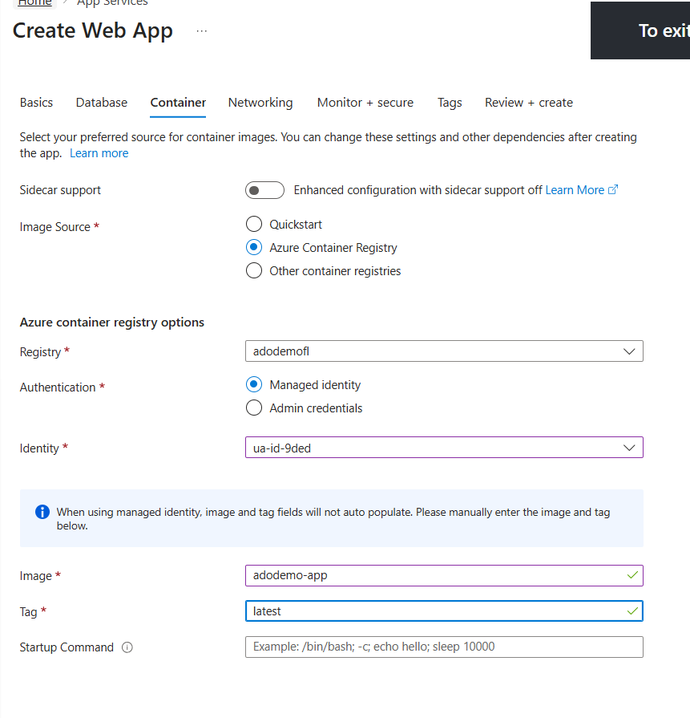
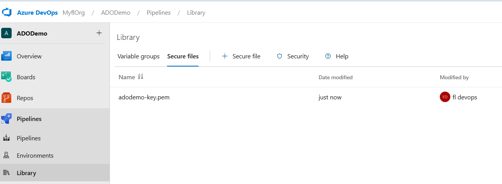

# Introduction 
This project is on the "Azure DevOps: Zero to Hero Course" Available [here.](https://aka.ms/AzureDevOps/ZeroToHero)

## Prerequisites

Create a new Azure DevOps Organization (i.e. MyflOrg, name must be unique)

Create a new Project (i.e ADODemo)

Go to Project Settings / General / Overwiew - Use Agile Process for the new Project

Optional, Go to Boards / Project Config - Create Sprints & Areas

Create a Self-Hosted Agent.

Microsoft stopped automatically granting free compute time (parallelism) to new Azure DevOps organizations to prevent crypto-mining abuse and you will get [error]No hosted parallelism has been purchased or granted. 

Solution

- Request Microsoft to enable your free tier.(2-5 business days) or
- Create a Self-Hosted Agent

 

Step 1: Create a Personal Access Token (PAT)

- In Azure DevOps, click the User Settings icon (top right, next to your avatar) and select Personal access tokens.
- Click + New Token.
- Name: AgentToken
- Scope: Select Custom defined and then click Show all scopes at the bottom.
- Find Agent Pools and select Read & manage.
- Click Create and copy the token immediately (you won't see it again).
 

Step 2: Register the Agent

- Go to Project Settings (bottom left) > Agent pools.
- Click on the Default pool.
- Click the New agent button at the top.
- Select your OS (Windows, macOS, or Linux).
- Follow the Download and Configure commands provided in the popup.
- When it asks for Server URL: Use https://dev.azure.com/{your-organization-name}
- When it asks for Authentication type: Press Enter for PAT, then paste your token.
- When it asks for Agent Pool: Press Enter to use Default.
- Run as service: Say Yes (if on Windows/Linux) so it starts automatically.

 

Create container registry

- !

 

Create Service Connection

- Go to Project Settings / Pipelines / Service Connections 
- Add New service Connection - Type Docker registry 

Create App Service

- Go to Azure - App Services
- Create - Web App

- Create another 2 web apps for test and prod named ADODemo-Test & ADODemo-prod

Upload ssh-key to Deploy to external environment (aws/on-prem)

- Go to  Pipelines / Library / Secure files and upload the SSH-Key file needed by the script used in DeployProdAWS Stage.

CLONING THE REPO & RUN THE PIPELINE

Go to Repo / Files and Clone this github

Go to Pipelines and open the azure-pipelines.yml

Run the Pipeline (manually approve the Deployprod stage)

